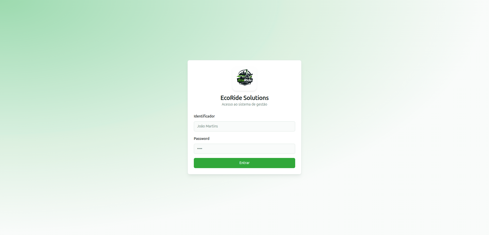
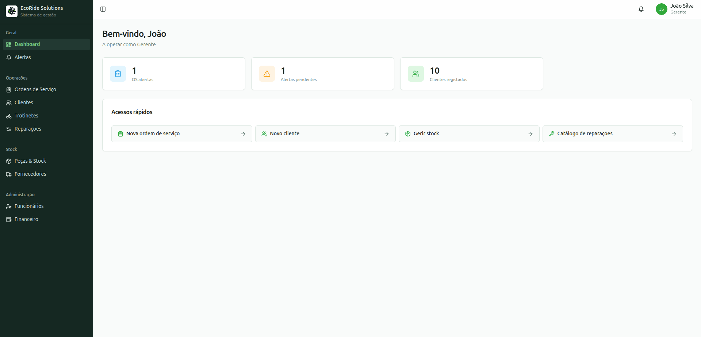
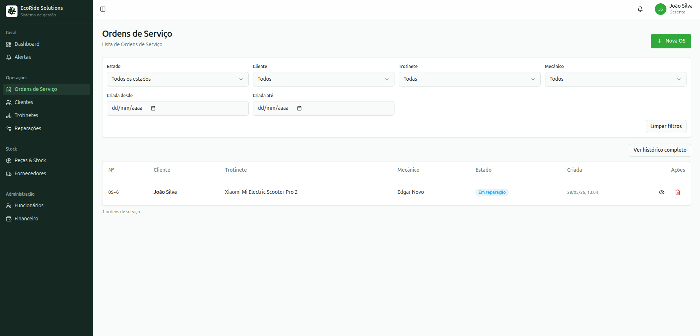
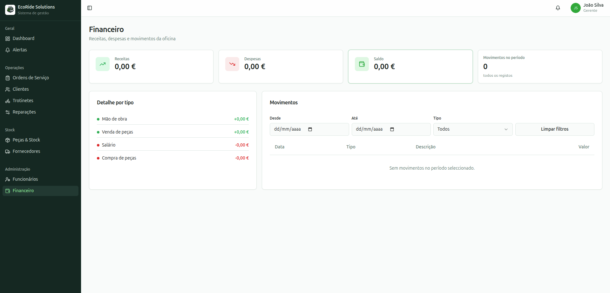

# LI4 (Laboratórios de Informática IV) (Português)

Projeto de grupo desenvolvido no âmbito da Unidade Curricular de LI4. O projeto consiste no desenvolvimento de um sistema de gestão para a empresa EcoRide Solutions — uma aplicação web de gestão de uma oficina de reparação de trotinetes elétricas, com suporte a ordens de serviço, stock, financeiro e notificações.

Pode consultar o enunciado do projeto, o relatório e os guias de manutenção e utilização:
- [Enunciado](assets/enunciado.pdf)
- [Relatório](reports/LI4-Relatorio-Grupo7.pdf)
- [Guia de Manutenção](reports/LI4-GuiaoManutencao-Grupo7.pdf)
- [Guia de Utilização](reports/LI4-GuiaoUtilizacao-Grupo7.pdf)

## Membros do grupo:

* [darteescar](https://github.com/darteescar)
* [luis7788](https://github.com/luis7788)
* [tiagofigueiredo7](https://github.com/tiagofigueiredo7)
* [inesferribeiro](https://github.com/inesferribeiro)

<p>
    
    
</p>
<p>
    
    
</p>


## Dependências

Para poder correr o sistema é necessário ter o [Docker](https://docs.docker.com/get-docker/) e o [Docker Compose](https://docs.docker.com/compose/install/) instalados.

## Arranque

Na diretoria `code/`, execute:

```bash
docker compose up --build
```

Após o arranque, os seguintes serviços ficam disponíveis:

- **Interface** → http://localhost:3000
- **API directa** → http://localhost:7000
- **Swagger UI** → http://localhost:8081

### Credenciais de acesso

| Identificador | Password   | Cargo        |
|---------------|------------|--------------|
| `admin`       | `admin123` | Gerente      |

### Parar o sistema

```bash
docker compose down
```

Para parar e apagar todos os dados (reset completo):

```bash
docker compose down -v
```


# LI4 (Laboratórios de Informática IV) (English)

Group project developed within the scope of the LI4 course. The project consists of the development of a management system for the company EcoRide Solutions — a web application for managing an electric scooter repair workshop, with support for work orders, stock, financials and notifications.

You can consult the assignment of the project, the report and the maintenance and user guides:
- [Assignment](assets/enunciado.pdf)
- [Report](reports/LI4-Relatorio-Grupo7.pdf) 
- [Maintenance Guide](reports/LI4-GuiaoManutencao-Grupo7.pdf)
- [User Guide](reports/LI4-GuiaoUtilizacao-Grupo7.pdf)

## Group members:

* [darteescar](https://github.com/darteescar)
* [luis7788](https://github.com/luis7788)
* [tiagofigueiredo7](https://github.com/tiagofigueiredo7)
* [inesferribeiro](https://github.com/inesferribeiro)

<p>
    
    
</p>
<p>
    
    
</p>


## Dependencies

To run the system you need to have [Docker](https://docs.docker.com/get-docker/) and [Docker Compose](https://docs.docker.com/compose/install/) installed.

## Starting the system

In the `code/` directory, run:

```bash
docker compose up --build
```

Once started, the following services are available:

- **Interface** → http://localhost:3000
- **Direct API** → http://localhost:7000
- **Swagger UI** → http://localhost:8081

### Login credentials

| Identifier | Password   | Role    |
|------------|------------|---------|
| `admin`    | `admin123` | Manager |

### Stopping the system

```bash
docker compose down
```

To stop and delete all data (full reset):

```bash
docker compose down -v
```
